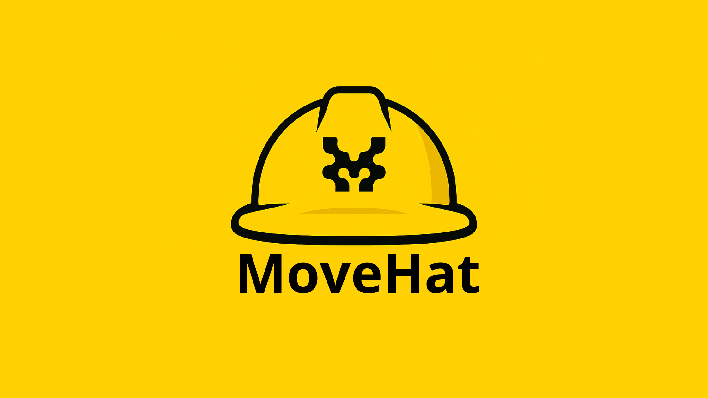

<div align="center">
  

  # Movehat

  **A Hardhat-like development framework for Movement L1 and Aptos Move smart contracts**

  Write your tests and deployment scripts in TypeScript while building Move smart contracts.

  [](https://www.npmjs.com/package/movehat)
  [](./LICENSE)

</div>

## Features

- **Transaction Simulation Testing** - Test your contracts without blockchain or gas costs (instant feedback)
- **Zero Setup Testing** - Auto-generated test accounts on Movement testnet (no configuration needed)
- **Auto-detection of Named Addresses** - Automatically detects and configures addresses from your Move code (like Hardhat)
- **Native Fork System** - Create local snapshots of Movement L1 with actual network state (JSON-based, no BCS issues)
- **TypeScript-first** - Write tests and deployment scripts in TypeScript
- **Hardhat-style accounts** - Single `PRIVATE_KEY` works across all networks
- **Multi-network support** - Configure multiple networks (testnet, mainnet, local)
- **Hardhat-like workflow** - Familiar commands and project structure
- **Movehat Runtime Environment** - Global context object similar to Hardhat's HRE
- **Movement CLI integration** - Wraps Movement CLI for compilation and publishing
- **Deployment tracking** - Automatic per-network deployment tracking (like hardhat-deploy)
- **Security-focused** - Built-in protection against path traversal, command injection, and YAML injection

## Prerequisites

Before installing Movehat, make sure you have:

- **Node.js** (v18 or later) - [Download](https://nodejs.org/)
- **Movement CLI** - **REQUIRED** for compiling and deploying Move contracts

  Install Movement CLI by following the official guide:
  [Movement CLI Installation Guide](https://docs.movementnetwork.xyz/devs/movementcli)

  Verify installation:
  ```bash
  movement --version
  ```

  ** Important:** Without Movement CLI installed, compilation will fail with:
  ```
  Compilation failed: Command failed: movement move build
  /bin/sh: movement: command not found
  ```

## Installation

```bash
npm install -g movehat
# or
pnpm install -g movehat
```

## Quick Start (30 seconds)

Get started with Movehat in 4 commands:

```bash
# 1. Create project
npx movehat init my-project && cd my-project

# 2. Install dependencies
npm install

# 3. Compile contracts (auto-detects addresses)
npx movehat compile

# 4. Run tests (uses simulation - no setup needed)
npm test
```

That's it! No blockchain, no accounts, no configuration needed to start testing.

**What just happened?**
- Tests run using **Transaction Simulation** (no real blockchain)
- Uses Movement testnet with **auto-generated test accounts**
- Zero setup - perfect for learning and rapid development

**Ready to deploy?** Set `PRIVATE_KEY` in `.env` and run deployment scripts. See detailed guide below.

**Want more details?** Check out the [complete Quick Start guide](./QUICKSTART.md).

---

## Detailed Setup Guide

### 1. Initialize a new project

```bash
mkdir my-move-project
cd my-move-project
movehat init
```

This creates the following structure:

```
my-move-project/
├── move/                     # Move smart contracts
│   ├── Move.toml
│   └── sources/
│       └── Counter.move
├── scripts/                  # Deployment scripts (TypeScript)
│   └── deploy-counter.ts
├── tests/                    # Test files (TypeScript)
│   └── Counter.test.ts
├── movehat.config.ts         # Movehat configuration
├── .env.example
├── package.json
└── tsconfig.json
```

### 2. Configure your environment (Optional for testing)

**For testing only?** Skip this step! Tests use simulation with auto-generated accounts.

**For real deployment?** Configure your private key:

```bash
cp .env.example .env
```

Edit `.env`:

```bash
# Your private key (works on all networks - Hardhat-style)
PRIVATE_KEY=0x1234567890abcdef...

# Optional: Override RPC URL
MOVEMENT_RPC_URL=https://custom-testnet.movementnetwork.xyz/v1
```

**Note:** Like Hardhat, Movehat uses a single `PRIVATE_KEY` that works across all networks (testnet, mainnet, local). This simplifies configuration and matches real-world usage.

**Security:** The `PRIVATE_KEY` is only required for:
- Real deployments to testnet/mainnet
- Running deployment scripts
- Tests automatically use safe, auto-generated test accounts (no configuration needed)

### 3. Install dependencies

```bash
npm install
# or
pnpm install
```

### 4. Compile your contracts

```bash
movehat compile
```

**How it works:**
- Movehat **automatically detects** named addresses from your Move files (e.g., `module counter::counter` → detects `counter`)
- No manual address configuration needed for development
- Uses temporary dev addresses (`0xcafe`) for compilation
- Just like Hardhat - add any new contract and it compiles automatically

### 5. Run deployment scripts

```bash
# Deploy to testnet (default)
movehat run scripts/deploy-counter.ts

# Deploy to specific network
movehat run scripts/deploy-counter.ts --network mainnet
movehat run scripts/deploy-counter.ts --network local
```

### 6. Run tests

```bash
npm test
# or
pnpm test
```

**How it works:**
- Tests use **Transaction Simulation** - no real blockchain or fork server required
- Runs instantly without gas costs or network delays
- Uses Movement testnet by default with auto-generated test accounts
- No local setup needed - perfect for CI/CD and rapid development

### 7. Use Fork System

MoveHat includes a native fork system for creating local snapshots of Movement L1 network state. This allows you to test against real network data without deploying to testnet.

**Create a fork:**
```bash
movehat fork create --network testnet --name my-fork
```

This creates a snapshot at the current ledger version with real network state (Chain ID: 250, actual balances, deployed contracts, etc.)

**View resources from the fork:**
```bash
movehat fork view-resource \
  --fork .movehat/forks/my-fork \
  --account 0x1 \
  --resource "0x1::coin::CoinInfo<0x1::aptos_coin::AptosCoin>"
```

**Fund accounts for testing:**
```bash
movehat fork fund \
  --fork .movehat/forks/my-fork \
  --account 0x123 \
  --amount 5000000000
```

**List all available forks:**
```bash
movehat fork list
```

**Serve fork via RPC:**
```bash
movehat fork serve --fork .movehat/forks/my-fork --port 8080
```

This starts a local RPC server that emulates a Movement L1 node using your fork's data. You can connect the Aptos/Movement SDK to `http://localhost:8080/v1` to interact with the fork state.

**Use in tests (programmatic API):**
```typescript
import { ForkManager } from 'movehat';

describe('Token Tests', () => {
  let fork: ForkManager;

  before(async () => {
    fork = new ForkManager('.movehat/forks/test');
    await fork.initialize('https://testnet.movementnetwork.xyz/v1', 'testnet');
  });

  it('should read real network data', async () => {
    const coinInfo = await fork.getResource(
      '0x1',
      '0x1::coin::CoinInfo<0x1::aptos_coin::AptosCoin>'
    );
    expect(coinInfo.name).to.equal('Move Coin');
  });

  it('should modify fork state for testing', async () => {
    await fork.fundAccount('0x123', 5_000_000_000);

    const coinStore = await fork.getResource(
      '0x123',
      '0x1::coin::CoinStore<0x1::aptos_coin::AptosCoin>'
    );
    expect(coinStore.coin.value).to.equal('5000000000');
  });
});
```

**Why use forks?**
- Test against real network state with actual balances and deployed contracts
- No need to deploy contracts to testnet for every test
- Modify state locally without affecting the network
- Lazy loading - only fetches resources you actually access
- JSON-based storage - human-readable and easy to inspect
- Works natively with Movement L1 (no BCS compatibility issues)

See [FORK_GUIDE.md](./FORK_GUIDE.md) for complete fork system documentation including architecture details and advanced usage.

## Configuration

### Network Configuration

Edit `movehat.config.ts` to configure your networks:

```typescript
import dotenv from "dotenv";
dotenv.config();

export default {
  // Default network to use when no --network flag is provided
  defaultNetwork: "testnet",

  // Network configurations
  networks: {
    testnet: {
      url: process.env.MOVEMENT_RPC_URL || "https://testnet.movementnetwork.xyz/v1",
      chainId: "testnet",
    },
    mainnet: {
      url: "https://mainnet.movementnetwork.xyz/v1",
      chainId: "mainnet",
    },
    local: {
      url: "http://localhost:8080/v1",
      chainId: "local",
    },
  },

  // Global accounts configuration (Hardhat-style)
  // Uses PRIVATE_KEY from .env by default
  accounts: process.env.PRIVATE_KEY ? [process.env.PRIVATE_KEY] : [],

  // Move source directory
  moveDir: "./move",

  // Named addresses (optional - auto-detected from Move files)
  // Only specify if you need specific addresses for production deployment
  namedAddresses: {
    // Example: counter: "0x1234...",
    // If not specified, Movehat auto-detects from your .move files
  },
};
```

**Key differences from other frameworks:**
- **One account for all networks** - Just like Hardhat, your `PRIVATE_KEY` works across testnet, mainnet, and local
- **Simpler configuration** - Networks only need to define their RPC URL
- **Flexible** - You can still specify different accounts per network if needed

## Writing Deployment Scripts

Deployment scripts use the **Movehat Runtime Environment (MRE)**:

```typescript
// scripts/deploy-counter.ts
import { getMovehat } from "movehat";

async function main() {
  const mh = await getMovehat();

  console.log("Deploying from:", mh.account.accountAddress.toString());
  console.log("Network:", mh.config.network);

  // Deploy (publish) the module
  // Movehat automatically checks if already deployed
  const deployment = await mh.deployContract("counter");

  console.log("Module deployed at:", deployment.address);
  console.log("Transaction:", deployment.txHash);

  // Get contract instance
  const contract = mh.getContract(deployment.address, "counter");

  // Initialize the counter
  await contract.call(mh.account, "init", []);

  console.log("Counter initialized!");
}

main().catch((error) => {
  console.error(error);
  process.exit(1);
});
```

### Deployment Tracking

Movehat **automatically tracks deployments** per network, similar to hardhat-deploy:

```
my-project/
└── deployments/
    ├── testnet/
    │   ├── counter.json
    │   └── token.json
    ├── mainnet/
    │   └── counter.json
    └── local/
        └── counter.json
```

Each deployment file contains:
```json
{
  "address": "0x662a2aa90fdf2b8e400640a49fc922b713fe4baaec8c37b088ecef315561e4d9",
  "moduleName": "counter",
  "network": "testnet",
  "deployer": "0x662a2aa90fdf2b8e400640a49fc922b713fe4baaec8c37b088ecef315561e4d9",
  "timestamp": 1704985623564,
  "txHash": "0x59cb0c2df832064174b50fc69909af5819c6e273cc644f9a2123102b20bb0ef2"
}
```

### Automatic Deployment Check

When you run a deployment script, Movehat **automatically checks** if the module is already deployed:

**First time:**
```bash
movehat run scripts/deploy-counter.ts --network testnet
# Deploys successfully
```

**Second time (already deployed):**
```bash
movehat run scripts/deploy-counter.ts --network testnet
# Error: Module "counter" is already deployed on testnet
#    Address: 0x662a...
#    Deployed at: 12/5/2025, 11:38:14 PM
#    Transaction: 0x59cb0c2df832...
#
#    To redeploy, run with the --redeploy flag:
#    movehat run <script> --network testnet --redeploy
```

**Force redeploy:**
```bash
movehat run scripts/deploy-counter.ts --network testnet --redeploy
# Redeploys and updates deployment info
```

### Available Runtime Properties

```typescript
const mh = await getMovehat();

// Core
mh.config         // Resolved configuration
mh.network        // Network info (name, chainId, rpc)
mh.aptos          // Aptos SDK client
mh.account        // Primary account
mh.accounts       // All configured accounts

// Contract helpers
mh.getContract    // Get contract helper

// Deployment functions
mh.deployContract       // Deploy and track module
mh.getDeployment        // Get deployment info for a module
mh.getDeployments       // Get all deployments for current network
mh.getDeploymentAddress // Get deployed address for a module

// Network management
mh.switchNetwork  // Switch to different network
```

### Using Multiple Accounts

```typescript
// movehat.config.ts - Configure multiple accounts
export default {
  accounts: [
    process.env.PRIVATE_KEY,     // Primary (mh.account)
    process.env.SECONDARY_KEY,   // mh.accounts[1]
  ].filter(Boolean),
};

// In your script - Access accounts
const mh = await getMovehat();
const primaryAccount = mh.account;               // accounts[0]
const secondaryAccount = mh.getAccountByIndex(1); // accounts[1]
```

## Writing Tests

Movehat supports **two types of tests** for comprehensive coverage:

### 1. Move Unit Tests (Fast & Internal)

Write tests directly in your Move files using `#[test]` annotations. Perfect for testing internal logic and business rules.

**Example from `move/sources/Counter.move`:**

```move
#[test(account = @0x1)]
public fun test_increment(account: &signer) acquires Counter {
    let addr = signer::address_of(account);
    aptos_framework::account::create_account_for_test(addr);

    init(account);
    assert!(get(addr) == 0, 0);

    increment(account);
    assert!(get(addr) == 1, 1);

    increment(account);
    assert!(get(addr) == 2, 2);
}
```

**When to use Move tests:**
- Testing internal logic and calculations
- Validating business rules and invariants
- Testing edge cases in pure functions
- TDD during Move development (ultra-fast feedback)

**Run Move tests:**
```bash
npm run test:move
# or
movehat test:move
```

---

### 2. TypeScript Integration Tests (Simulation-Based)

Write tests in TypeScript using **Transaction Simulation**. Perfect for end-to-end testing without real blockchain:

```typescript
// tests/Counter.test.ts
import { describe, it, before } from "mocha";
import { expect } from "chai";
import { getMovehat, type MovehatRuntime } from "movehat";

describe("Counter Contract", () => {
  let mh: MovehatRuntime;
  let contractAddress: string;

  before(async function () {
    this.timeout(30000);

    // Initialize Movehat Runtime Environment
    // Uses Movement testnet by default with auto-generated test accounts
    mh = await getMovehat();
    contractAddress = mh.account.accountAddress.toString();

    console.log(`\nTesting on ${mh.network.name}`);
    console.log(`Account: ${contractAddress}\n`);
  });

  it("should initialize counter using simulation", async function () {
    this.timeout(30000);

    // Build transaction
    const transaction = await mh.aptos.transaction.build.simple({
      sender: mh.account.accountAddress,
      data: {
        function: `${contractAddress}::counter::init`,
        functionArguments: []
      }
    });

    // Simulate transaction (no gas cost, instant)
    const [simulation] = await mh.aptos.transaction.simulate.simple({
      signerPublicKey: mh.account.publicKey,
      transaction
    });

    // Verify simulation succeeded
    expect(simulation.success).to.be.true;
    console.log(`Counter init simulated successfully`);
    console.log(`Gas used: ${simulation.gas_used}`);
  });

  it("should increment counter using simulation", async function () {
    this.timeout(30000);

    // Build increment transaction
    const transaction = await mh.aptos.transaction.build.simple({
      sender: mh.account.accountAddress,
      data: {
        function: `${contractAddress}::counter::increment`,
        functionArguments: []
      }
    });

    // Simulate transaction
    const [simulation] = await mh.aptos.transaction.simulate.simple({
      signerPublicKey: mh.account.publicKey,
      transaction
    });

    // Verify simulation succeeded
    expect(simulation.success).to.be.true;
    console.log(`Counter increment simulated successfully`);
    console.log(`Gas used: ${simulation.gas_used}`);
  });
});
```

**Why Transaction Simulation?**
- **No blockchain required** - Tests run without executing real transactions
- **Instant feedback** - No network delays or gas costs
- **Zero setup** - Uses Movement testnet with auto-generated test accounts
- **CI/CD friendly** - Perfect for continuous integration pipelines
- **Gas estimation** - See how much gas your transactions would use

**When to use real transactions:**
- For end-to-end integration testing, use the fork system (see above)
- For production deployment verification
- Transaction simulation is perfect for unit testing contract logic

## CLI Commands

### `movehat init [project-name]`

Initialize a new Movehat project.

```bash
movehat init my-project
movehat init  # Uses current directory
```

### `movehat compile`
Compile Move smart contracts using Movement CLI.

### `movehat run <script> [--network <name>] [--redeploy]`
Execute a TypeScript/JavaScript script with the Movehat Runtime.

```bash
movehat run scripts/deploy-counter.ts --network testnet
movehat run scripts/deploy-counter.ts --network testnet --redeploy  # Force redeploy
```

### `movehat test`
Run your Mocha test suite in the `tests/` directory.

### `movehat fork <command>`

Manage local forks of Movement/Aptos networks. See [FORK_GUIDE.md](./FORK_GUIDE.md) for complete documentation.

**Available commands:**
- `fork create` - Create a new fork from a network
- `fork list` - List all available forks
- `fork view-resource` - View a resource from the fork
- `fork fund` - Fund an account in the fork
- `fork serve` - Start a local RPC server serving the fork

```bash
# Create a fork
movehat fork create --network testnet --name my-fork

# Start fork server
movehat fork serve --fork .movehat/forks/my-fork --port 8080

# List all forks
movehat fork list
```

## Environment Variables

```bash
# Required: Your wallet private key (works on all networks - Hardhat-style)
PRIVATE_KEY=0x1234567890abcdef...

# Optional: Override RPC URL or default network
MOVEMENT_RPC_URL=https://custom-testnet.movementnetwork.xyz/v1
MH_DEFAULT_NETWORK=mainnet
```

**Account resolution:** Movehat looks for accounts in this order:
1. Network-specific `accounts` in config
2. Global `accounts` in config
3. `PRIVATE_KEY` env variable

## Examples

### Deploy and Initialize

```typescript
import { getMovehat } from "movehat";

async function main() {
  const mh = await getMovehat();

  // 1. Deploy (publish) the module
  // Automatically checks if already deployed
  const deployment = await mh.deployContract("counter");
  console.log("Module deployed at:", deployment.address);
  console.log("Transaction:", deployment.txHash);

  // 2. Initialize
  const contract = mh.getContract(deployment.address, "counter");
  await contract.call(mh.account, "init", []);

  // 3. Verify
  const value = await contract.view("getValue", []);
  console.log("Initial value:", value);
}

main().catch(console.error);
```

### Multi-Network Deployment

```typescript
import { getMovehat } from "movehat";

async function main() {
  const mh = await getMovehat();

  if (mh.config.network === "mainnet") {
    console.log("WARNING: Deploying to MAINNET");
    // Add confirmation logic
  }

  // Deploy module - automatically tracked per network
  const deployment = await mh.deployContract("counter");
  console.log(`Deployed on ${mh.config.network}:`, deployment.address);
}

main().catch(console.error);
```

## Troubleshooting

### Common Errors

| Error | Solution |
|-------|----------|
| "Configuration file not found" | Create `movehat.config.ts` in your project root |
| "Network 'X' not found" | Add the network to `networks` in config |
| "No accounts configured" | Set `PRIVATE_KEY` in `.env` |
| "Module not found" | Run `movehat compile` first |
| "movement: command not found" | Install [Movement CLI](https://docs.movementnetwork.xyz/devs/movementcli) - **REQUIRED** |
| "Compilation failed: ENOENT: no such file or directory, uv_cwd" | Your current directory was deleted. Run `cd ~` then navigate to your project |
| "Cannot find package 'dotenv'" | Run `npm install` or `pnpm install` in your project directory |

### System Requirements

**Required:**
- Node.js v18+
- Movement CLI (install from [Movement docs](https://docs.movementnetwork.xyz/devs/movementcli))
- npm or pnpm

**What happens if Movement CLI is not installed:**
- `movehat compile` will fail with "command not found" error
- You won't be able to build or deploy contracts
- Solution: Install Movement CLI before using Movehat

**Recommended:**
- Git (for version control)
- VS Code with Move syntax highlighting extension

## Contributing

See [CONTRIBUTING.md](./CONTRIBUTING.md) for development setup and guidelines.

## License

MIT

## Links

- [Quick Start Guide](./QUICKSTART.md) - Get started in 30 seconds
- [Fork System Guide](./FORK_GUIDE.md) - Complete fork system documentation
- [GitHub Repository](https://github.com/gilbertsahumada/movehat)
- [NPM Package](https://www.npmjs.com/package/movehat)
- [Movement Documentation](https://docs.movementlabs.xyz/)
- [Aptos SDK](https://aptos.dev/sdks/ts-sdk/)

## Author

**Gilberts Ahumada**

[](https://x.com/@gilbertsahumada)
[](https://www.youtube.com/@gilbertsahumada)
[](https://gilbertsahumada.com)
